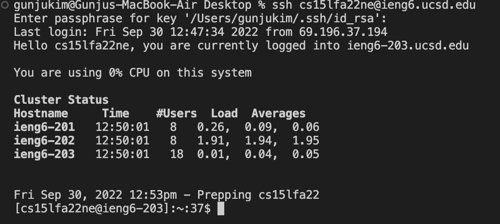

# Tutorial of Remote Access and File System
### 093022
### Lab Report 1
### Gunju Kim

## Step 1. Download the vscode
> ###  1. First go to this [link](https://code.visualstudio.com/) to download vscode.
## 
> ###  2. After you download the vscode, the below screen will be shown.
## 

## Step 2. Remotely Connecting
> ### 1. Open the terminal in the vscode by clicking terminal>new terminal on the top bar of your Mac.
> ### 2. On the screen type " ssh cs15lfa22ne@ieng6.ucsd.edu ".
> ### 3. Enter your password for your course account.
> ### 4. If this is your first login, reply yes to the question, "Are you sure you want to continue connecting?"
## 

## Step 3. Trying Some Commands
> ### 1. 
> ### 2.
> ### 3.

## Step 4. Moving Files with scp
> ### 1. 
> ### 2.
> ### 3.
## 

## Step 5. Setting an SSH Key
> ### 1. 
> ### 2.
> ### 3.
## 

## Step 6. Optimizing Remote Running
> ### 1. 
> ### 2.
> ### 3.
## 