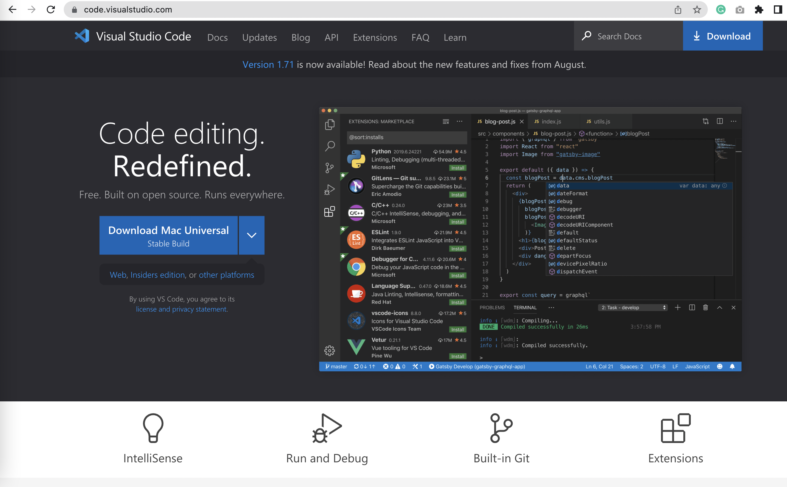
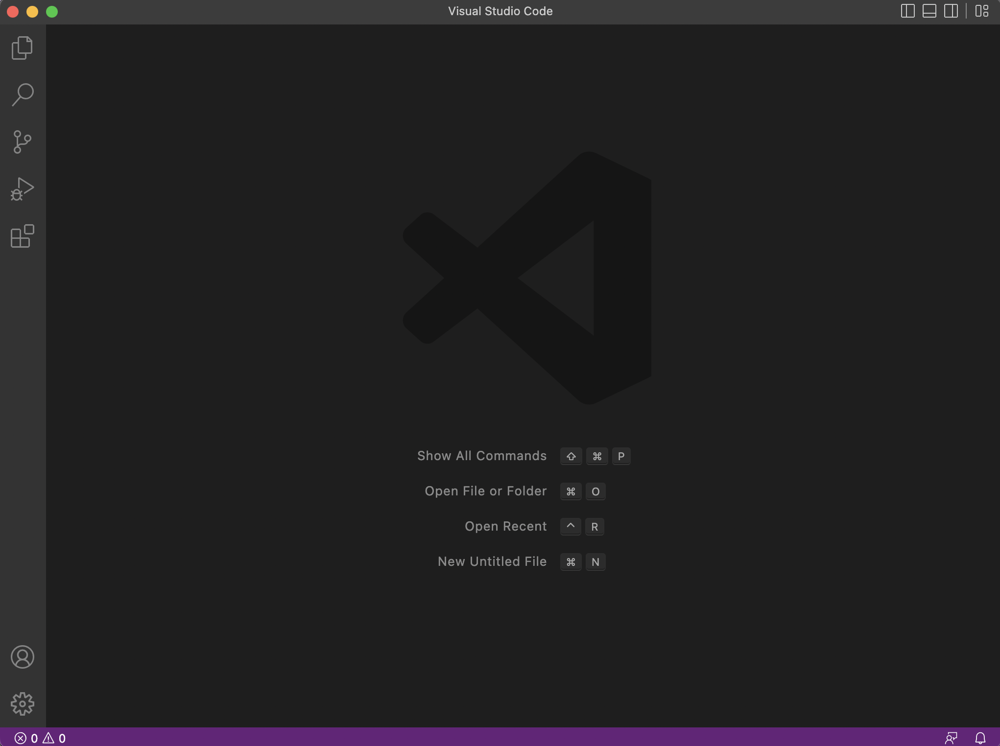

# Tutorial of Remote Access and File System
### Made by. Gunju Kim

1. First go to this [link](https://code.visualstudio.com/) to download vscode.

2. After you download the vscode, the below screen will be shown.
