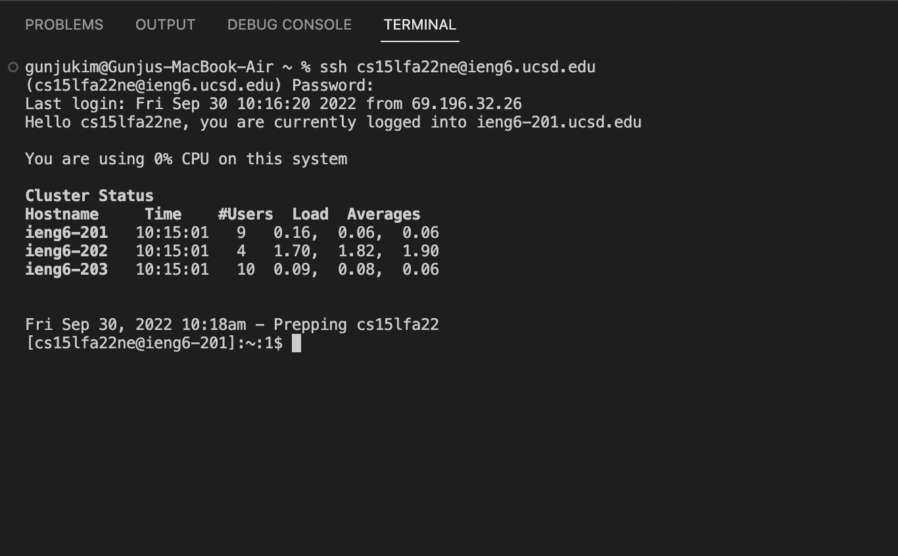
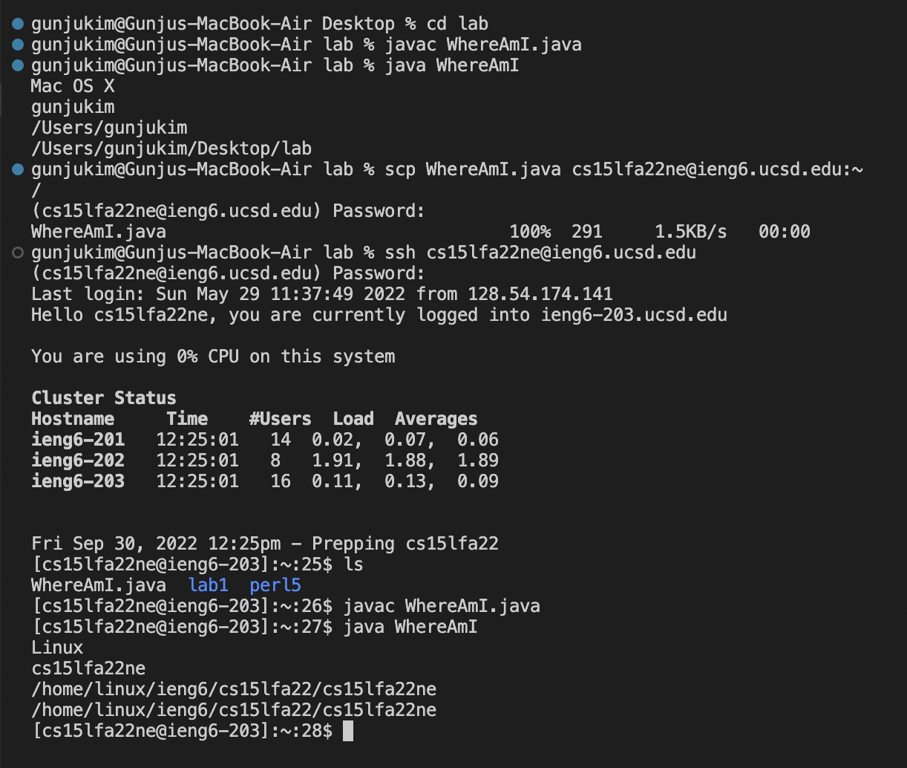
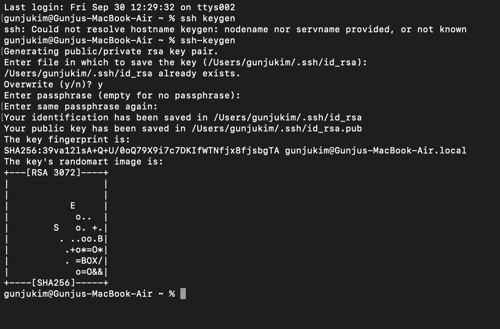
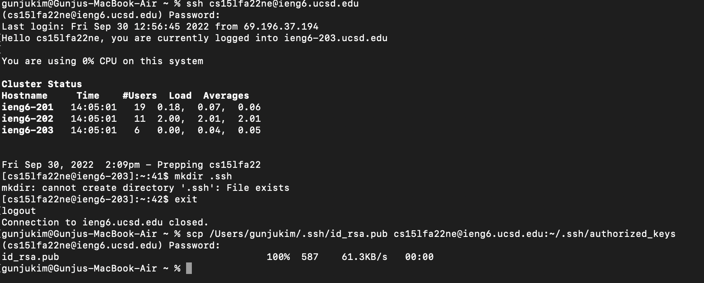
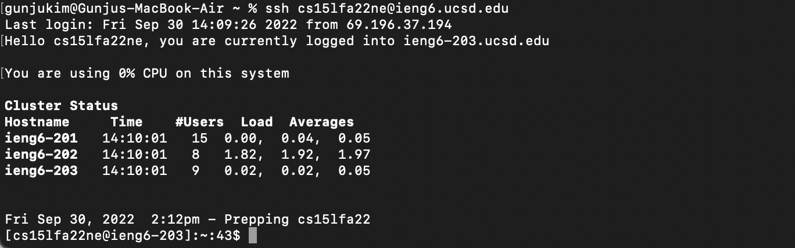

# Tutorial of Remote Access and File System
### 093022
### Lab Report 1
### Gunju Kim


## Step 1. Download the vscode
> ###  1. First go to this [link](https://code.visualstudio.com/) to download vscode.
## 
> ###  2. After you download the vscode, the below screen will be shown.
## 


## Step 2. Remotely Connecting
> ### 1. Open the terminal in the vscode by clicking terminal>new terminal on the top bar of your Mac.
> ### 2. On the screen, type " ssh cs15lfa22ne@ieng6.ucsd.edu ".
> ### 3. Enter your password for your course account.
> ### 4. If this is your first login, reply yes to the question, "Are you sure you want to continue connecting?"
## 


## Step 3. Trying Some Commands
> ### 1. 
> ### 2.
> ### 3.
## 


## Step 4. Moving Files with scp
> ### 1. First, create 'WhereAmI.java' file on your computer.
```
class WhereAmI {
  public static void main(String[] args) {
    System.out.println(System.getProperty("os.name"));
    System.out.println(System.getProperty("user.name"));
    System.out.println(System.getProperty("user.home"));
    System.out.println(System.getProperty("user.dir"));
  }
}
```
> ### 2.
> ### 3.
## 


## Step 5. Setting an SSH Key
> ### 1. On your desktop's terminal, enter "ssh-keygen". This will generate your public and private key.
> ### 2. Click 'Enter' if "Enter file in which to save the key" pops up.
> ### 3. Then, click 'Enter' if you want to login without entering password. (this will save more time!)
## 
> ### 4. Now, login in your course account and enter the password. Then make a new directoy, '.ssh' by entering 'mkdir .ssh'.
> ### 5. Enter 'exit' to log out from the server.
> ### 6. Now, copy your public key into the server by entering 'scp /Users/gunjukim/.ssh/id_rsa.pub cs15lfa22ne@ieng6.ucsd.edu:~/.ssh/authorized_keys'.
## 
> ### 7. If you login again using 'ssh', you no longer have to enter your password! (This actually saved me 30 seconds in changing and saving the file.)
## 


## Step 6. Optimizing Remote Running
> ### 1. 
> ### 2.
> ### 3.